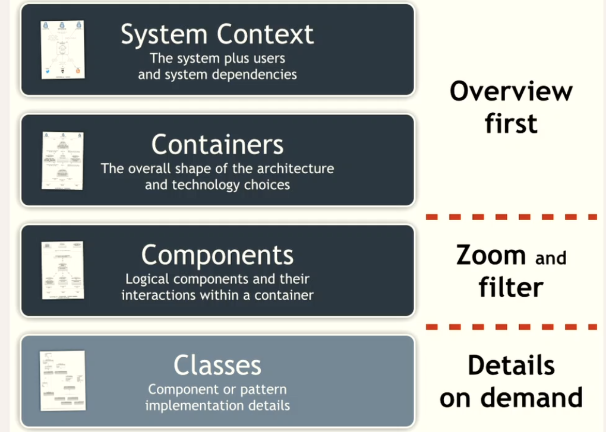

# Lecture 4 Architectural Views and Perspectives
### Domain-Driven Design(DDD)
A successful design must systematically deal with this central aspect of the software.
### Strategic model co-evolution
- As learning progresses, models evolve
- Ideally: contexts can evolve independently
- Reality: contexts have dependencies requiring co-evolution
- Co-evolution can be realized with different(strategic) organizational patterns, such as:
  - **Partnership**(eg.,common kernel)
  - **Conformism**(one context is in the lead, the other follows)
  - **Anti-corruption layer**("adapter" keeping both contexts clean)

---
### Software Architecture
The Architecture of a system(IEEE):
  - The set of fundamental concepts or properties,
  - of the system in its environment
  - embodied in its elements and relationships,
  - and the principles of its design and evolution.
### Architectural Decision, models, and Views
* Models are helpful abstractions to explain key architectural decision.
* Many different types of models exist, serving different purposes.
* Views are ways of organizing architectural decisions to address different concerns.
* No single model/view can capture the "full" architecture.
### Software Architecture Views
* System context
* Functional
* Logical 
* Physical
* Deployment
* and more!

### Visualizing Software Architecture

